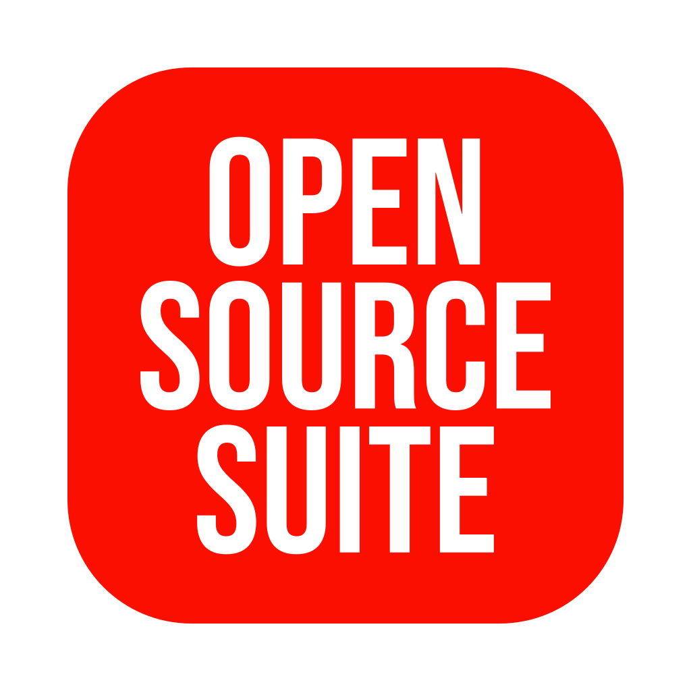
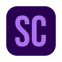
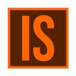
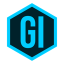
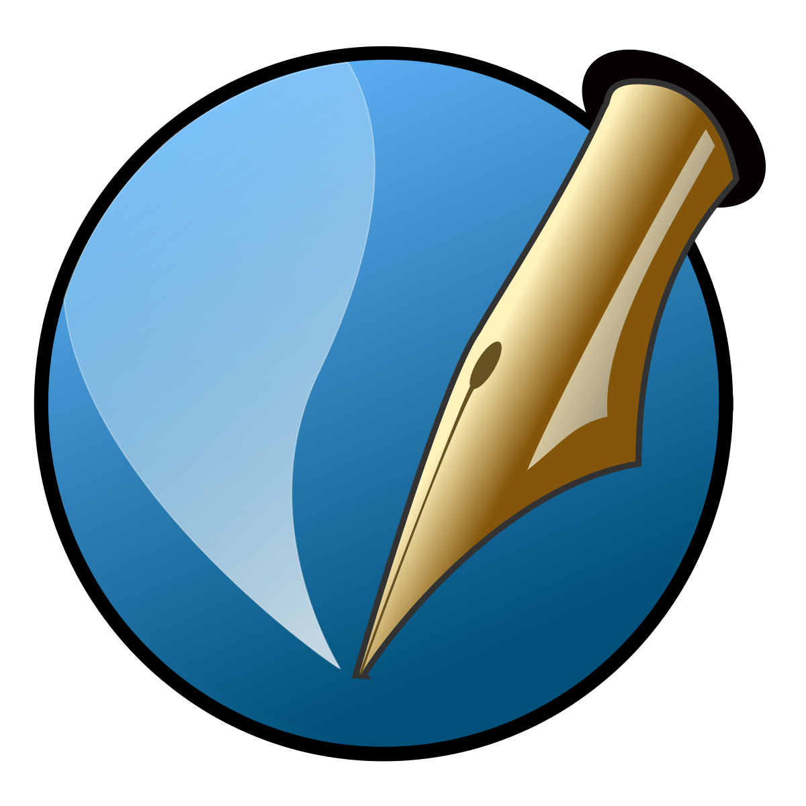

# Open Source Suite Icons

Welcome to the Open Source Suite Icons repository! This project is dedicated to providing a set of replacement icons for various open-source software applications that form a suite of powerful tools for creative and productive work.



## About

Open Source Suite Icons aims to enhance the visual appeal of your open-source software applications while maintaining their functionality. We believe that well-designed icons can greatly improve your user experience and make your workspace more visually pleasing.

## Features

- **Enhanced Aesthetics:** Our icons offer a fresh and modern look to your favorite open-source software applications, giving them a professional and unified appearance.

- **Recognition and Usability:** We have carefully designed these icons to retain the essence of each application's original icon, ensuring that you can easily identify and launch the software you need.

- **Diverse Selection:** This repository provides replacement icons for a wide range of open-source applications, ensuring that you can give a visual makeover to many of your essential tools.

- **User-Friendly Installation:** We've included clear and straightforward installation instructions to help you effortlessly replace the default icons of your open-source software.

## How to Use

Customizing your open-source software icons is a breeze with our step-by-step instructions. Whether you're using Windows, macOS, or Linux, you'll find guidance specific to your operating system in each application's respective folder.

## Icon Collection

Our collection includes icons for the following open-source applications:

- Gimp
- Inkscape
- Scribus
- Synfig
- Darktable
- OpenShot
- Shotcut

|                            Gimp                            |                              Inkscape                              |                             Scribus                              |                             Synfig                             |                              Darktable                               |                              Openshot                              |                             ShotCut                              |
| :--------------------------------------------------------: | :----------------------------------------------------------------: | :--------------------------------------------------------------: | :------------------------------------------------------------: | :------------------------------------------------------------------: | :----------------------------------------------------------------: | :--------------------------------------------------------------: |
|  |  |  |  |  |  |  |

I used to have access to Adobe Suite. Most of my design work was done with Illustrator, Photoshop, Animate and (a little) Indesign. Now I want to replace that with opensource applications. And as an exersice I wanted to change the icons in a Adobe Suite kinda way.

## Application Replacement

Are you transitioning from Adobe Suite to open-source alternatives? Here's a quick reference for replacing Adobe Suite applications with open-source equivalents:

| Adobe Suite       | Open Source |
| ----------------- | ----------- |
| Adobe Photoshop   | Gimp        |
| Adobe Illustrator | Inkscape    |
| Adobe Indesign    | Scribus     |
| Adobe Animate     | Synfig      |
| Adobe Lightroom   | Darktable   |
| Adobe Premiere    | OpenShot    |
| Adobe Premiere    | Shotcut     |

## Installation of Open-Source Applications

The easiest way to install these open-source applications on macOS is via [HomeBrew](https://brew.sh/). Make sure you have Homebrew installed and run the following commands in your terminal:

```bash
# install
brew install --cask gimp # 👈 gimp: 2.10.32
brew install --cask inkscape # 👈 inkscape: 1.2.1
brew install --cask scribus # 👈 scribus: 1.5.8
brew install --cask synfigstudio # 👈 synfig: 1.5.1
brew install --cask darktable # 👈 darktable: 4.4.2
brew install --cask openshot-video-editor # 👈 openshot-video-editor: 3.1.1
brew install --cask shotcut # 👈 shotcut: 23.07.29
```

> Please note that the provided versions may change over time, so keep this in mind if you encounter any discrepancies with the instructions.

## Creating New Icons

To create or modify icons, you can use the provided Inkscape file: [icons.svg](design/icons.svg). Ensure that you have the [Bebas Neue](https://fonts.google.com/specimen/Bebas+Neue) font installed or replace it with your preferred font.

Generate the icons using the [bash](all.sh) script as follows:

```bash
sh all.sh
```

For installing rounded icons, use the following command:

```bash
sh icons_rounded.sh
```

## Icon Paths

You can update the icons by copying them to the respective folders:

**On macOS:**

- Gimp: `/Applications/GIMP.app/Contents/Resources/gimp.icns`
- Inkscape: `/Applications/Inkscape.app/Contents/Resources/inkscape.icns`
- Scribus: `/Applications/Scribus.app/Contents/Resources/Scribus.icns`
- SynfigStudio: `/Applications/SynfigStudio.app/Contents/Resources/SynfigStudio.icns`
- OpenShot: `/Applications/OpenShot\ Video\ Editor.app/Contents/Resources/icon.icns`
- Darktable: `/Applications/darktable.app/Contents/Resources/Icons.icns`
- Shotcut: `/Applications/Shotcut.app/Contents/Resources/shotcut.icns`

**On Windows:**:

- Gimp: ``
- Inkscape: ``
- Scribus: ``
- SynfigStudio: ``
- OpenShot: ``
- Darktable: ``
- Shotcut: ``

**On Linux:**

- Gimp: ``
- Inkscape: ``
- Scribus: ``
- SynfigStudio: ``
- OpenShot: ``
- Darktable: ``
- Shotcut: ``

## New Logo Styles

We offer a variety of logo styles for each application:

- Square
- Hexagon
- Rounded

Choose the style that best fits your preferences and workspace aesthetics.

| Type    | Gimp                                                       | Inkscape                                                           | Scribus                                                          | Synfig                                                         |
| ------- | ---------------------------------------------------------- | ------------------------------------------------------------------ | ---------------------------------------------------------------- | -------------------------------------------------------------- |
| Square  |   |   |   |                                                                |
| Hexagon |  |  |  |                                                                |
| Rounded |  |  |  |  |

<!--
## Old logos

| Gimp                       | Inkscape                      | Scribus                      |
| -------------------------- | ----------------------------- | ---------------------------- |
|  |  |  |

Scribus | Gimp | Inkscape | Synfig


-->

## Learn More

Explore the open-source alternatives to Adobe Suite:

- https://inkscape.org/
- https://www.gimp.org/ or https://github.com/Diolinux/PhotoGIMP
- https://www.scribus.net/
- https://synfig.org/
- https://www.openshot.org/
- https://shotcut.org/
- https://www.darktable.org/

Thank you for choosing Open Source Suite Icons to elevate your open-source software experience. We hope you find these icons valuable in enhancing your workspace's visual appeal!
